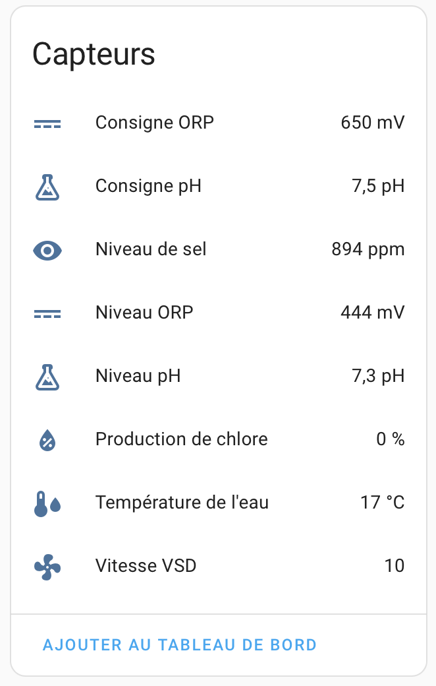
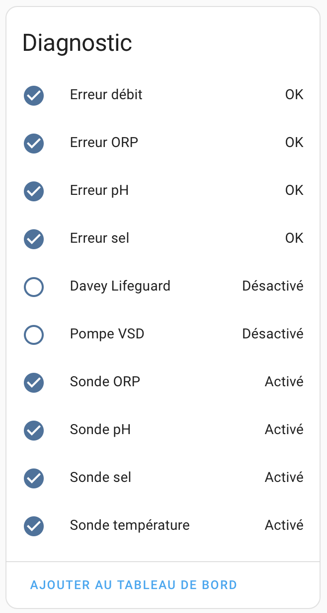
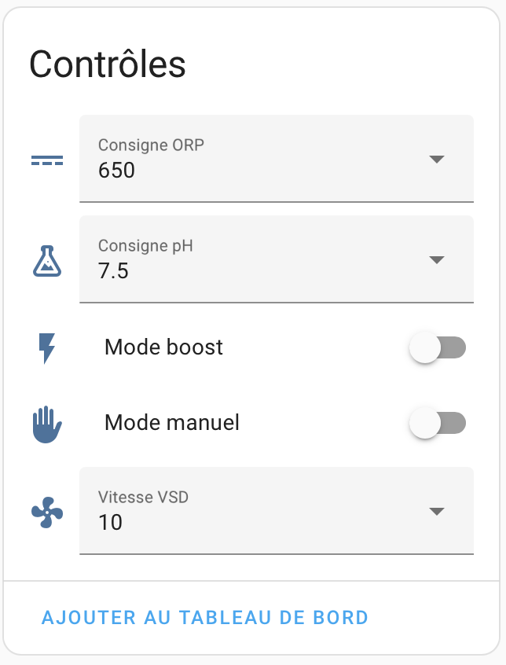

[](https://buymeacoffee.com/morganbattig)

# Home Assistant Integration: Davey Lifeguard


## Project Summary

This project is a custom integration for Home Assistant, designed to seamlessly integrate with Davey Lifeguard connected pool management systems. Developed by an independent enthusiast, this integration aims to centralize the monitoring and control of your pool directly within the Home Assistant interface.

## Key Features

This initial release offers the following functionalities:

### Real-time Sensor Monitoring
Keep a close eye on your pool's vital parameters:
* Water pH
* ORP (Oxidation-Reduction Potential)
* Water Temperature
* Salinity
* Chlorine Production Rate
* VSD Pump Speed



### Equipment Status and Diagnostics
Stay informed about your system's health:
* Connection status of all probes
* Overall device status
* Detection of common errors (flow, ORP, pH, salt)



### Equipment Control
Manage essential pool functions directly from Home Assistant:
* Activate/deactivate operating modes (manual, boost)
* Set the desired pH level
* Set the desired ORP level
* Adjust the VSD pump speed



## Technical Overview

* Leverages Home Assistant's `DataUpdateCoordinator` for efficient data retrieval.
* Communicates with the Davey cloud API (local access is currently unavailable).
* Secure authentication using tokens and refresh tokens via `config_entry`.
* Optimized API requests using `asyncio.gather`.
* Supports both English and French, with dynamic entity naming based on your language preference.
* Organizes entities logically as `sensor`, `binary_sensor`, `switch`, and `select` components.
* **UI-first integration**: Configuration is done entirely through the Home Assistant UI, no YAML editing required.
* Compatible with Home Assistant version 2023.x and later.

## Target Audience

This integration is primarily intended for:

* Home Assistant users who own a Davey Lifeguard system.
* Individuals seeking to integrate their pool management into their smart home ecosystem.
* Developers interested in contributing to the project's growth.

## Project Status

* ✅ First functional version released.
* 🚧 Currently under active development.
* ✅ Successfully tested with a real Davey Lifeguard system.

## Installation

You can install this integration using either HACS (recommended) or a manual approach.

### Installation via HACS (Home Assistant Community Store)

1.  **Ensure HACS is installed.** If not, please follow the official installation guide: [https://hacs.xyz/docs/use/](https://hacs.xyz/docs/use/).
2.  **Add this repository as a custom repository in HACS:**
    * Navigate to "HACS" in the Home Assistant sidebar.
    * Go to "Integrations".
    * Click the three dots (`...`) in the top right corner and select "Custom repositories".
    * In the "Add custom repository" dialog:
        * **Repository:** `https://github.com/ForWarZz/davey_lifeguard_ha`
        * **Category:** Integration
        * Click "Add".
3.  **Install the "Davey Lifeguard" integration:**
    * After adding the repository, close the "Custom repositories" dialog.
    * Click the "+" button at the bottom right of the HACS Integrations page ("Explore & add repositories").
    * Search for "Davey Lifeguard" and click on it.
    * Click "Download".
4.  **Restart your Home Assistant server.**
5.  **Configure the integration:**
    * After restarting, go to "Settings" > "Devices & Services".
    * Click "+ Add Integration" in the bottom right corner.
    * Search for "Davey Lifeguard" and click to configure.
    * Follow the on-screen prompts to enter your Davey Lifeguard account credentials.

### Manual Installation

1.  **Access your Home Assistant configuration directory.**
2.  **Create a `custom_components` directory** if it doesn't exist.
3.  **Inside `custom_components`, create a directory named `davey_lifeguard`.**
4.  **Download the integration files** from the repository and place them in the `custom_components/davey_lifeguard/` directory.
    ```
    <your_config_directory>/
    └── custom_components/
        └── davey_lifeguard/
            ├── __init__.py
            ├── config_flow.py
            ├── sensor.py
            ├── switch.py
            └── ... (other integration files)
    ```
5.  **Restart your Home Assistant server.**
6.  **Configure the integration:** Follow the same configuration steps as in the HACS installation.

## Contributing

As this is a personal project and my first Home Assistant integration, contributions are highly welcome! Areas for potential contribution include:

* Code optimization and improvements.
* Development of an advanced configuration UI.
* Adding support for more sensors and entities.
* Providing translations for additional languages.

## Important Notes

This is an early release, and as such, **improvements are expected, and bugs may be present.** Your patience and feedback are greatly appreciated in helping to refine this integration. Please also note that **not all planned features are currently implemented**, and development will continue based on user feedback and ongoing efforts.

Thank you for your interest and support! I look forward to your feedback and to making this integration even better.
